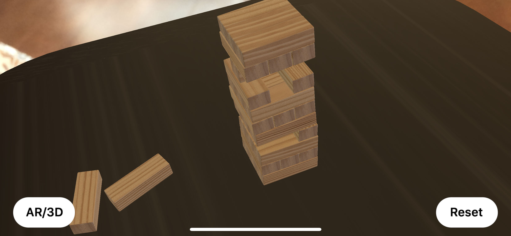
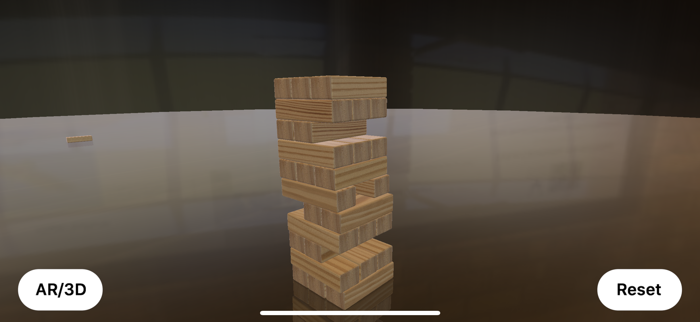

# ARBlockTower
Project for WWDC18 Scholarship formatted into an iOS app using ARKit and SceneKit. Place a Block Tower and see how you stack up against gravity.

[View on YouTube](https://www.youtube.com/watch?v=xpKNT1dRKks)

[View Original Playground](https://github.com/Nicholas714/WWDC-2018)

### Screenshots 

